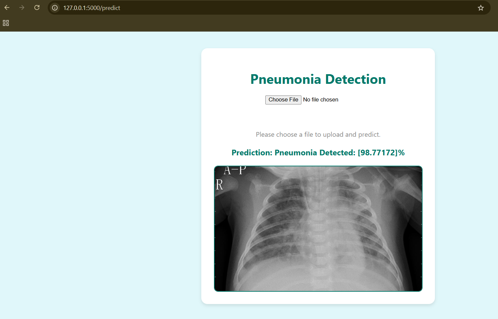

# Pneumonia Detection Using Deep Learning

A Flask-based web application for automated pneumonia detection from chest X-ray images using a transfer learning Convolutional Neural Network (CNN). This project demonstrates the deployment of a deep learning model for real-time medical image classification through a user-friendly web interface.

## Features

- **Deep Learning Model:** Utilizes a pretrained CNN (transfer learning) for accurate pneumonia detection.
- **Web Interface:** Simple and modern UI for uploading chest X-ray images and viewing predictions.
- **Real-Time Prediction:** Instant feedback on uploaded images.
- **Secure File Handling:** Uploaded images are securely handled and stored.
- **Image Preview:** Uploaded images are displayed with fixed sizing for consistent user experience.

## Demo

 

## Getting Started

### Prerequisites

- Python 3.7+
- pip

### Installation

1. **Clone the repository:**
    ```bash
    git clone https://github.com/Khelendrarauniyar/Pneumonia-Detection-Using-Deep-Learning.git
    cd Pneumonia-Detection-Using-Deep-Learning/code
    ```

2. **Install dependencies:**
    ```bash
    pip install -r requirements.txt
    ```

3. **Add the trained model:**
    - Place your `pneumonia_detection_transfer_learning.h5` model file in the `code` directory.

4. **Run the application:**
    ```bash
    python app.py
    ```

5. **Open your browser and go to:**
    ```
    http://localhost:5002
    ```

## Usage

1. Upload a chest X-ray image (`.jpg`, `.jpeg`, or `.png`).
2. Click "Upload and Predict".
3. View the prediction and the uploaded image.

## Project Structure
code/ │ ├── app.py ├── predict.py ├── requirements.txt ├── pneumonia_detection_transfer_learning.h5 ├── static/ │ └── uploads/ ├── templates/ │ └── index.html


## Model

- The model is based on transfer learning using a pretrained CNN (e.g., VGG16, ResNet).
- Trained to classify chest X-ray images as "Pneumonia" or "Normal".

## License

This project is licensed under the MIT License.

## Acknowledgements

- [Kaggle Chest X-Ray Images (Pneumonia) Dataset](https://www.kaggle.com/paultimothymooney/chest-xray-pneumonia)
- TensorFlow & Keras

---

*For any questions or contributions, feel free to open an issue or pull request!*
